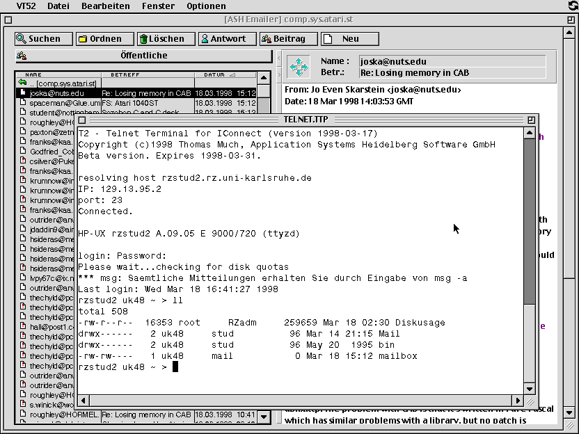

# T2 telnet client

At the end of the last millenium I wrote a small telnet client for the internet stack of the TOS-compatible MagiC operating system.
It is running as a console app in a VT52 terminal emulation.

## Disclaimer

This source code is completely out of date. It is provided as-is without any warranty.

I publish the source files for historical / archaeological reasons only, for informational purposes.
The code is not intended to be used any more, especially not as a template for new code.

## Please note

T2 was built using the Pure C compiler. Documentation is available in German only (sorry).

Have fun! :-)

Thomas\
@thmuch

## Screenshots

